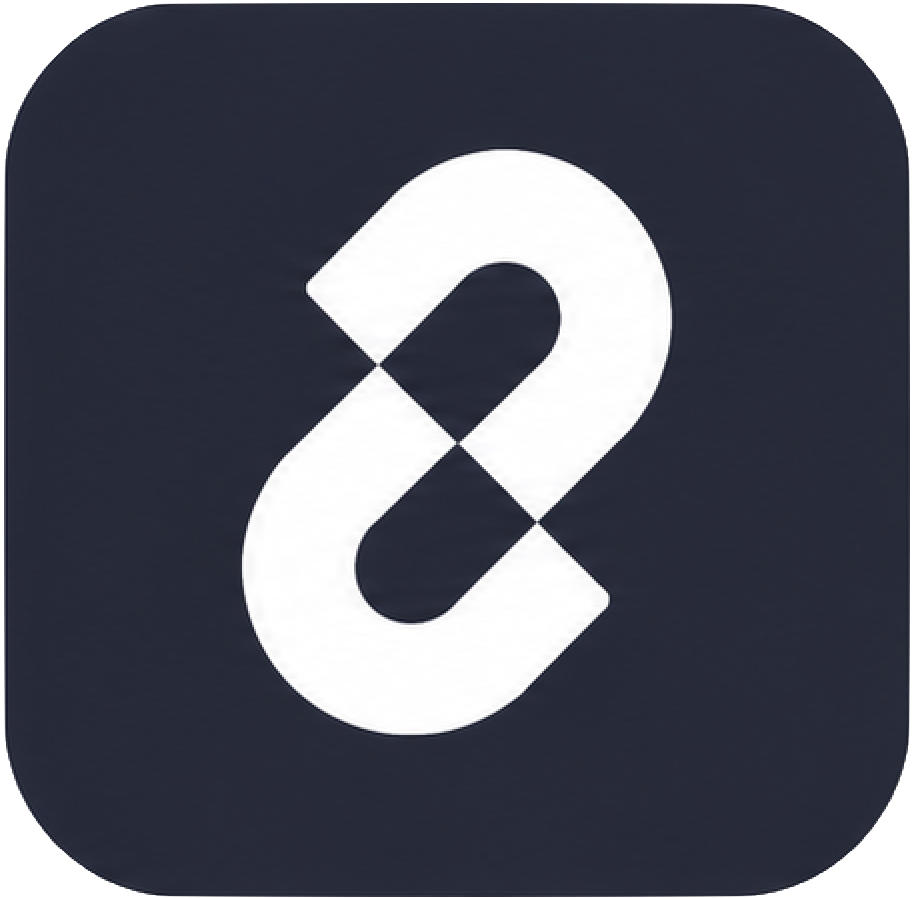
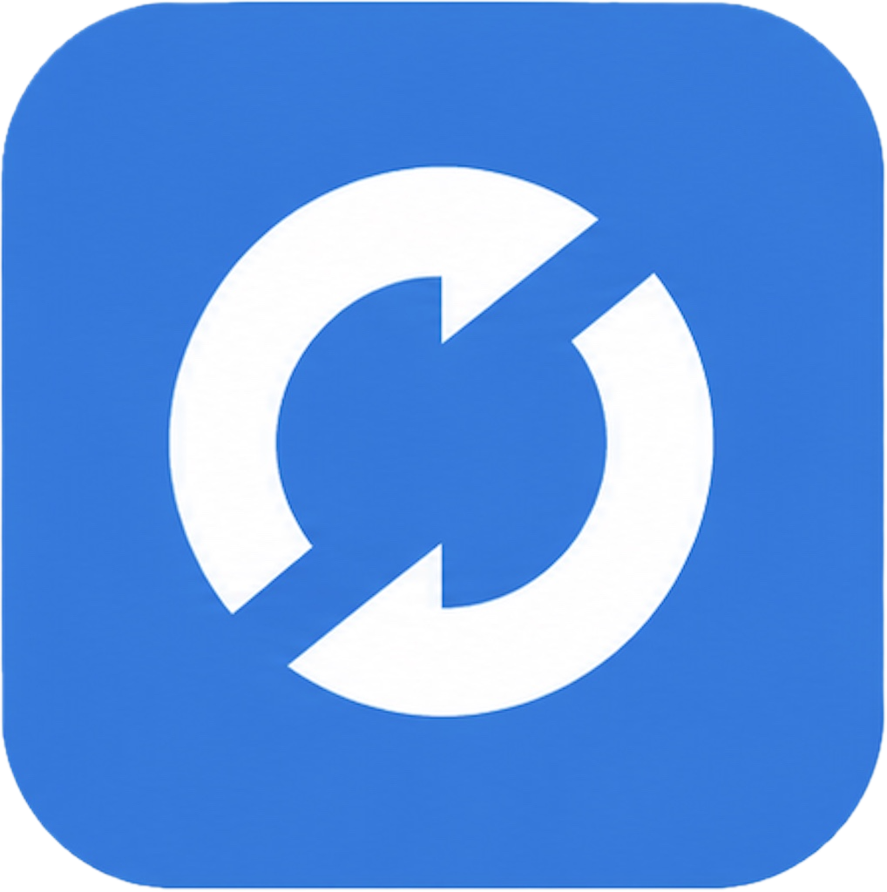

<h1>Mohamed-Amine Rguigue</h1>

 

&nbsp;

&nbsp;

&nbsp;

---

## About Me

From **medical school to AI engineering** — an unconventional path driven by one constant: understanding complex systems and building things that matter.

- 🎓 Engineering student in **Data & Artificial Intelligence** at **ESIEE Paris** (2025–2028)
- 🧠 Focused on **deep learning, generative AI and agentic systems** — from training models from scratch to building LLM-powered applications
- 📈 Strong interest in **AI applied to finance** — investment research, quantitative methods, decision support
- ⚙️ Building solid foundations in **MLOps and production AI** — Docker, MLflow, deployment pipelines
- 🚀 Long-term: become a **T-shaped AI engineer** capable of designing, training and shipping complete AI products
- 📍 Paris / Île-de-France, France

---

## 🎯 Looking for an AI Apprenticeship

**December 2026 → September 2028 · Paris · Île-de-France**

 

&nbsp;
&nbsp;
&nbsp;
&nbsp;
&nbsp;
&nbsp;

  

| Period | Dates |
|:---|:---|
| Dec 2026 → Mar 2027 | 7 December 2026 → 19 March 2027 |
| Jun 2027 → Sep 2027 | 21 June 2027 → 1 September 2027 |
| Dec 2027 | 20 December 2027 → 31 December 2027 |
| Mar 2028 → Sep 2028 | 20 March 2028 → 22 September 2028 |

---

## 💻 Tech Stack

 

&nbsp;
&nbsp;
&nbsp;

 

 

---

## 🚀 Projects

<table>
<tr>
<td width="50%" valign="top">

**[CIFAR-10 CNN from Scratch](https://github.com/mohamed-amine-rguigue/cifar10-cnn-from-scratch)**

Trained and compared 4 CNN architectures on CIFAR-10 (60k images). Best model: **86.7% accuracy** (+17.2 pts vs baseline) using dropout, L2, BatchNorm and data augmentation.

`Python` `TensorFlow` `Keras` `Deep Learning`

</td>
<td width="50%" valign="top">

**[Cybersecurity Awareness Game](https://github.com/mohamed-amine-rguigue/cybersecurity-awareness-game)**

Serious game on phishing, passwords and social engineering — built in a team of 3 with Phaser 3, WebGL and Canvas 2D. Delivered in 2 months.

`JavaScript` `Phaser 3` `WebGL` `Game Design`

</td>
</tr>
</table>

---

Paris · 2026

